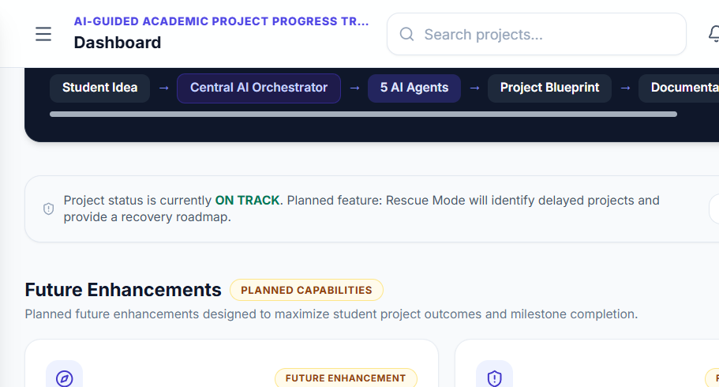
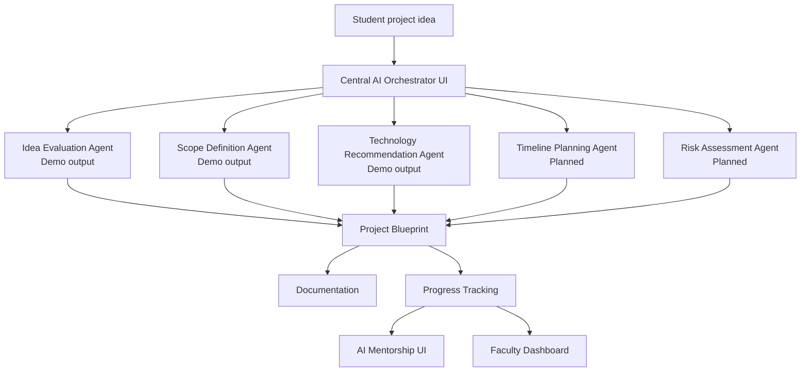

# AI-Guided Academic Project Progress Tracking Platform

> A focused workspace for planning, analyzing, tracking, documenting, and supervising academic projects.

An AI-oriented academic project management interface that brings project setup, structured analysis, milestone tracking, mentorship guidance, documentation, and faculty review into one product experience.

[](https://react.dev/)
[](https://www.typescriptlang.org/)
[](https://vite.dev/)
[](https://tailwindcss.com/)

## Dashboard Preview



## Project Overview

The platform is designed for academic project teams and the faculty or mentors who supervise them. Students can create a project, capture its problem statement and idea, review structured analysis, follow academic milestones, generate documentation drafts, and receive contextual next-step guidance. Faculty and mentors can inspect project health, progress, status, milestones, and analysis from a dedicated monitoring view.

The current repository is a frontend prototype. It demonstrates the product workflow with in-memory state and bundled demo data; it does not currently connect to a backend, database, external AI provider, or authentication service.

## Problem Statement

Academic project work is often spread across disconnected notes, chat messages, documents, and status updates. This makes it harder to:

- turn an initial idea into a clear project scope;
- capture requirements, domain, team size, and expected duration consistently;
- choose and evaluate a suitable technology direction;
- plan work across recognizable milestones;
- identify delayed or at-risk projects early;
- maintain an understandable record of progress and evidence;
- prepare synopsis, report, architecture, and presentation material; and
- give faculty a reliable view of project status without manual follow-up.

## Solution

The interface models the academic project lifecycle as one connected workspace. A student starts with a structured project form, reviews an analysis workflow and project blueprint, then moves through progress tracking, mentorship, and documentation views. Faculty and mentor users enter a monitoring dashboard that summarizes project health and opens detailed project inspection views.

The AI language in the product describes the intended orchestration workflow. In this repository, the workflow is represented through UI states, static result data, and client-side interactions rather than live model calls.

## Key Features

### Project Workspace

- Project creation form for title, problem statement, idea, domain, team size, and duration.
- My Projects view with project status, progress, team, student, and last-updated information.
- Project Blueprint view that consolidates project inputs, analysis outputs, milestones, and workflow stages.

### Analysis And Planning

- AI Project Analysis view with visible agent statuses and a completion path to the Project Blueprint.
- Implemented demo outputs for Idea Evaluation, Scope Definition, and Technology Recommendation.
- Timeline Planning and Risk Assessment cards are represented as planned agent capabilities in the UI.

### Progress And Guidance

- Nine-stage milestone tracker covering problem identification, requirements, literature survey, architecture, development, AI integration, testing, deployment, and documentation.
- Progress summary with completion percentage, current milestone, and project health status.
- AI Mentorship view with contextual guidance for the selected project.
- “What Should I Do Today?” guidance component with a prioritized next action.

### Documentation And Review

- Documentation workspace that generates client-side drafts for synopsis, abstract, problem statement, objectives, project report, system architecture, flowchart, UML, PPT content, and a user manual.
- Copy-to-clipboard support for generated document content.
- Faculty Dashboard with project summary statistics, filtering, search, and detailed project inspection.

### Demo And Product UI

- Sign-in and sign-up flows with local demo authentication.
- Student, Faculty, and Mentor role selection.
- Responsive dashboard shell with sidebar navigation, notifications, profile controls, modal dialogs, status badges, and toast feedback.

## User Roles

The implemented role model contains three roles:

| Role | Current product behavior |
| --- | --- |
| **Student** | Creates projects, views project analysis and blueprints, follows milestones, reviews mentorship guidance, and prepares documentation drafts. |
| **Faculty** | Opens the Faculty Dashboard, filters and searches projects, reviews summary metrics, and inspects project details and progress. |
| **Mentor** | Uses the same monitoring destination as Faculty in the current prototype and can inspect project status and progress. |

An **Admin** role is not currently implemented in the source code. User administration, department management, permissions management, and platform-level administration should therefore be treated as future work rather than current functionality.

## AI Architecture

The product UI presents a Central AI Orchestrator that routes a student project idea toward specialized planning tasks and downstream product views.

### Current implementation status

| Agent | Status in this repository | Evidence in the product |
| --- | --- | --- |
| **Central AI Orchestrator** | UI workflow only | Routes the displayed analysis flow to agent cards and project outputs; no live orchestration service is present. |
| **Idea Evaluation Agent** | Implemented as demo UI output | Shown as a completed agent in the AI analysis and agent views. |
| **Scope Definition Agent** | Implemented as demo UI output | Shown as a completed agent in the AI analysis and agent views. |
| **Technology Recommendation Agent** | Implemented as demo UI output | Shown as a completed agent in the AI analysis and agent views. |
| **Timeline Planning Agent** | Planned | Displayed with a planned status. |
| **Risk Assessment Agent** | Planned | Displayed with a planned status. |



The repository does not contain a backend implementation, provider SDK, API route, prompt service, database adapter, or persistence layer for this architecture. Product copy references Claude in some demo views and generated documents, but no external Claude request is made by the current codebase.

## Planned Enhancements

The following capabilities are visible as planned or are not implemented in the current repository:

- Live AI Orchestrator and provider-backed agent execution.
- Timeline Planning and Risk Assessment agent logic.
- Backend API and persistent project storage.
- Real authentication, authorization, and user management.
- An Admin role and administration workspace.
- Durable project history, collaboration, and server-side document storage.
- Production integrations for GitHub, evidence collection, notifications, and deployment.

## Technology Stack

- **React 19** for the component-based user interface.
- **TypeScript** for application types and domain models.
- **Vite** for development and production bundling.
- **Tailwind CSS** for styling utilities and responsive layouts.
- **Lucide React** for interface icons.
- **In-memory React Context state** for authentication, navigation, projects, toasts, and selected-project state.

## Getting Started

### Prerequisites

- Node.js 18 or later
- npm

### Installation

```bash
npm install
```

### Start the development server

```bash
npm run dev
```

Open the local URL printed by Vite. Use the demo sign-in or sign-up flow to explore the application. No external credentials or environment variables are required for the current prototype.

### Build for production

```bash
npm run build
```

### Run lint checks

```bash
npm run lint
```

## Project Structure

```text
.
├── .gitignore
├── .oxlintrc.json
├── public/
│   ├── dashboard-preview.png   # README product screenshot
│   ├── favicon.svg
│   └── icons.svg
├── src/
│   ├── components/             # Reusable dashboard and feature components
│   ├── data/demo.ts            # Bundled demo projects and select options
│   ├── pages/                  # Product views and workflows
│   ├── assets/                 # Frontend image and SVG assets
│   ├── App.tsx                 # Application shell and page switching
│   ├── context.tsx             # In-memory application state and demo auth
│   ├── index.css               # Tailwind directives and global styles
│   ├── main.tsx                # React entry point
│   └── types.ts                # Domain and UI types
├── build.bat                   # Windows production-build helper
├── export-zip.bat              # Windows project-export helper
├── index.html                  # Vite HTML entry point
├── package-lock.json           # Locked npm dependency versions
├── package.json
├── postcss.config.js           # PostCSS configuration
├── README.md
├── run-dev.bat                 # Windows development-server helper
├── tailwind.config.ts
├── tsconfig.app.json
├── tsconfig.node.json
├── tsconfig.json
├── vite.config.ts
└── node_modules/               # Installed dependencies; do not commit
```

Generated folders such as `dist/` are not shown because they are build output and should not be committed. `node_modules/` is listed for orientation only and is excluded by `.gitignore`.

The structure above is a visual documentation tree; it does not create folders on GitHub. GitHub creates `src/` automatically when its files are uploaded or pushed. Make sure the repository contains `src/App.tsx`, `src/main.tsx`, and the `src/components/`, `src/pages/`, `src/assets/`, and `src/data/` directories.

Navigation is implemented through `AppContext` page state rather than a routing package. Project changes remain in browser memory and reset when the application reloads.

## Project Status

This repository is a frontend product prototype suitable for demonstrating the academic project planning and monitoring experience. The interface, workflows, local demo authentication, static agent results, documentation drafts, and dashboard views are implemented. Backend services, persistent storage, live AI execution, and production authentication are outside the current scope.

## License

No license has been specified for this repository yet.
